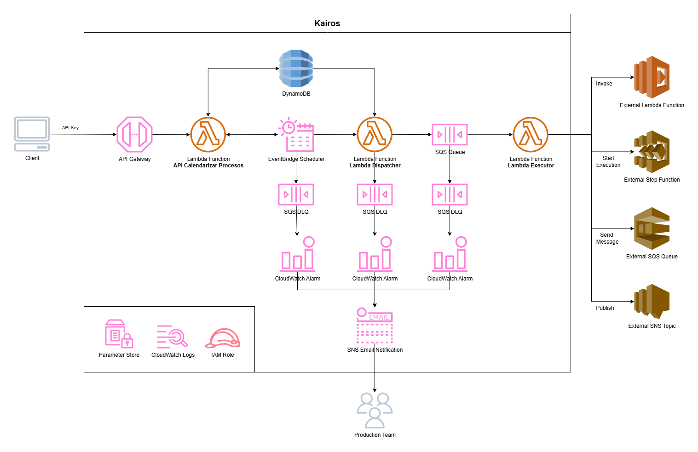

# Kairos - Calendarización de Procesos

- [Kairos - Calendarización de Procesos](#kairos---calendarización-de-procesos)
  - [Introducción](#introducción)
    - [Diagrama Arquitectura](#diagrama-arquitectura)
  - [Recursos Requeridos](#recursos-requeridos)
    - [API Gateway Custom Domain Name](#api-gateway-custom-domain-name)
  - [Recursos Creados](#recursos-creados)
    - [Modelo de Datos](#modelo-de-datos)
      - [DynamoDB Tables y Global Secondary Index](#dynamodb-tables-y-global-secondary-index)
      - [Systems Manager String Parameter](#systems-manager-string-parameter)
    - [Sistema de Colas](#sistema-de-colas)
      - [SQS Queue y Dead Letter Queue](#sqs-queue-y-dead-letter-queue)
      - [SNS Topic y CloudWatch Alarm](#sns-topic-y-cloudwatch-alarm)
      - [Systems Manager String Parameter](#systems-manager-string-parameter-1)
    - [Lambda Dispatcher](#lambda-dispatcher)
      - [Log Group e IAM Role](#log-group-e-iam-role)
      - [Lambda Function](#lambda-function)
      - [Systems Manager String Parameter](#systems-manager-string-parameter-2)
    - [Lambda Executor](#lambda-executor)
      - [Log Group e IAM Role](#log-group-e-iam-role-1)
      - [Systems Manager String Parameter](#systems-manager-string-parameter-3)
      - [Lambda Function (con Event Source)](#lambda-function-con-event-source)
    - [Recursos para Schedulers](#recursos-para-schedulers)
      - [Schedule Group](#schedule-group)
      - [Dead Letter Queue](#dead-letter-queue)
      - [SNS Topic y CloudWatch Alarm](#sns-topic-y-cloudwatch-alarm-1)
      - [IAM Role](#iam-role)
      - [Systems Manager String Parameter](#systems-manager-string-parameter-4)
    - [API Calendarizar Procesos](#api-calendarizar-procesos)
      - [Log Group e IAM Role](#log-group-e-iam-role-2)
      - [Lambda Function](#lambda-function-1)
      - [Access Log Group](#access-log-group)
      - [Lambda Rest API](#lambda-rest-api)
      - [API Mapping](#api-mapping)
      - [Usage Plan y API Key](#usage-plan-y-api-key)
      - [API Gateway Permission](#api-gateway-permission)
      - [Systems Manager String Parameter](#systems-manager-string-parameter-5)
  - [Lógica de Lambdas](#lógica-de-lambdas)
    - [API para Calendarizar Procesos](#api-para-calendarizar-procesos)
      - [Endpoints](#endpoints)
      - [Código](#código)
    - [Lambda Dispatcher](#lambda-dispatcher-1)
      - [Código](#código-1)
    - [Lambda Executor](#lambda-executor-1)
      - [Código](#código-2)
  - [Despliegue](#despliegue)
    - [Variables y Secretos de Entorno](#variables-y-secretos-de-entorno)

## Introducción

* Kairos es una herramienta para la calendarización de procesos.
* El siguiente repositorio es para desplegar Kairos, lo que incluye la creación de [Lambdas](https://aws.amazon.com/es/lambda/), [API Gateway](https://aws.amazon.com/es/api-gateway/), [DynamoDB](https://aws.amazon.com/es/dynamodb/), [EventBridge Scheduler](https://aws.amazon.com/es/eventbridge/scheduler/), [SQS Queues](https://aws.amazon.com/es/sqs/), [CloudWatch Alarms](https://aws.amazon.com/es/cloudwatch/), [SNS Topics](https://aws.amazon.com/es/sns/).
* La infraestructura se despliega mediante IaC, usando [AWS CDK en .NET 8.0](https://docs.aws.amazon.com/cdk/api/v2/dotnet/api/).
* El despliegue CI/CD se lleva a cabo mediante  [GitHub Actions](https://github.com/features/actions).

### Diagrama Arquitectura



## Recursos Requeridos

### API Gateway Custom Domain Name

Es necesario contar con un Custom Domain Name ya asociado a API Gateway, esto dado a que se usará para crear el API Mapping.

<ins>Código donde se usará Custom Domain Name</ins>

```csharp
using Amazon.CDK.AWS.Apigatewayv2;

// Creación de la CfnApiMapping para el API Gateway...
CfnApiMapping apiMapping = new(this, ..., new CfnApiMappingProps {
    DomainName = domainName,
    ApiMappingKey = ...,
    ApiId = ...,
    Stage = ...,
});
```

Para ver un ejemplo de como crear un Custom Domain Name: [BDiazEApiGatewayCDK](https://github.com/bdiaze/BDiazEApiGatewayCDK)

## Recursos Creados

### Modelo de Datos

En primer lugar, se comenzará creando las tablas necesarias para almacenar la información de los procesos y calendarizaciones.

#### DynamoDB Tables y Global Secondary Index

<ins>Código para crear :</ins>

```csharp
```

#### Systems Manager String Parameter

<ins>Código para crear :</ins>

```csharp
```

### Sistema de Colas

En segundo lugar, dado que no se conoce la cantidad ni duración de los procesos a ejecutar, se contará con un sistema de colas para no saturar la [Lambda Executor](#lambda-executor).

#### SQS Queue y Dead Letter Queue

<ins>Código para crear :</ins>

```csharp
```

#### SNS Topic y CloudWatch Alarm

<ins>Código para crear :</ins>

```csharp
```

#### Systems Manager String Parameter

<ins>Código para crear :</ins>

```csharp
```

### Lambda Dispatcher

En tercer lugar, se creará una Lambda cuyo proposito será obtener todos los procesos habilitados asociados a una calendarización e ingresarlos en la [cola para su ejecución](#sqs-queue-y-dead-letter-queue).

#### Log Group e IAM Role

<ins>Código para crear :</ins>

```csharp
```

#### Lambda Function

<ins>Código para crear :</ins>

```csharp
```

#### Systems Manager String Parameter

<ins>Código para crear :</ins>

```csharp
```

### Lambda Executor

En cuarto lugar, se creará una Lambda cuyo proposito será gatillar la ejecución de los procesos según lo que obtenga desde la [cola de procesos](#sqs-queue-y-dead-letter-queue).

#### Log Group e IAM Role

<ins>Código para crear :</ins>

```csharp
```

#### Systems Manager String Parameter

<ins>Código para crear :</ins>

```csharp
```

#### Lambda Function (con Event Source)

<ins>Código para crear :</ins>

```csharp
```

### Recursos para Schedulers

En quinto lugar, se crearán los recursos necesarios para la creación de los schedulers, esto incluye el schedule group, la DLQ con su respectivo Alarm y SNS Topic, IAM Role e String Parameters.

#### Schedule Group

<ins>Código para crear :</ins>

```csharp
```

#### Dead Letter Queue

<ins>Código para crear :</ins>

```csharp
```

#### SNS Topic y CloudWatch Alarm

<ins>Código para crear :</ins>

```csharp
```

#### IAM Role

<ins>Código para crear :</ins>

```csharp
```

#### Systems Manager String Parameter

<ins>Código para crear :</ins>

```csharp
```

### API Calendarizar Procesos

En último lugar, se creará la API que calendarizará la ejecución de procesos. Esta API creará el Scheduler si no existiese uno y registrará el proceso para su ejecución en éste.

#### Log Group e IAM Role

<ins>Código para crear :</ins>

```csharp
```

#### Lambda Function

<ins>Código para crear :</ins>

```csharp
```

#### Access Log Group

<ins>Código para crear :</ins>

```csharp
```

#### Lambda Rest API

<ins>Código para crear :</ins>

```csharp
```

#### API Mapping

<ins>Código para crear :</ins>

```csharp
```

#### Usage Plan y API Key

<ins>Código para crear :</ins>

```csharp
```

#### API Gateway Permission

<ins>Código para crear :</ins>

```csharp
```

#### Systems Manager String Parameter

<ins>Código para crear :</ins>

```csharp
```

## Lógica de Lambdas

### API para Calendarizar Procesos

El principal proposito de la API es calendarizar o descalendarizar la ejecución de procesos, recepcionando la información del proceso, registrandolo y creando el schedule asociado si no existe. Para esto, la API contiene los siguientes endpoints:

#### Endpoints
<table>
<tr>
<th>URL</th>
<th>Método</th>
<th>Cuerpo</th>
<th>Retorno</th>
</tr>
<tr>
<td>

`/Procesos`

</td>
<td>

`POST`

</td>
<td>

```json
{
    "nombre": "...",
    "cron": "...",
    "arnRol": "...",
    "arnProceso": "...",
    "parametros": "...",
    "habilitado": true|false
}
```

</td>
<td>

```json
{
    "IdProceso": "...",
    "IdCalendarizacion": "...",
    "Nombre": "...",
    "ArnRol": "...",
    "ArnProceso": "...",
    "Parametros": "...",
    "Habilitado": true|false,
    "FechaCreacion": ""
}
```

</td>
</tr>
<tr>
<td>

`/Procesos/{idProceso}`

</td>
<td>

`DELETE`

</td>
<td>

`Sin Cuerpo`

</td>
<td>

`Sin Retorno`

</td>
</tr>
</table>

#### Código

```csharp
```

### Lambda Dispatcher

El principal proposito de la Lambda Dispatcher es ingresar a la cola todos los procesos relacionados con una calendarización en particular para su ejecución.

#### Código

```csharp
```

### Lambda Executor

El principal proposito de la Lambda Executor es gatillar la ejecución de los distintos procesos que se encuentran en la cola.

#### Código

```csharp
```

## Despliegue

El despliegue se lleva a cabo mediante GitHub Actions, para ello se configura la receta de despliegue con los siguientes pasos:

| Paso | Comando | Descripción |
|------|---------|-------------|
| Checkout Repositorio | `actions/checkout@v4` | Se descarga el repositorio en runner. |
| Instalar .NET | `actions/setup-dotnet@v4` | Se instala .NET en el runner. |
| Instalar Node.js | `actions/setup-node@v4` | Se instala Node.js en el runner. | 
| Instalar AWS CDK | `npm install -g aws-cdk` | Se instala aws-cdk con NPM. |
| Publish .NET AoT Minimal API | `docker run --rm -v ...:/src -w /src .../amazonlinux:2023 \bash -c "`<br> `yum install -y dotnet-sdk-8.0 gcc zlib-devel &&`<br> `dotnet publish /p:PublishAot=true -r linux-x64 --self-contained &&`<br> `cd ./publish &&`<br> `zip -r -T ./publish.zip ./*"`| Se publica y comprime el proyecto de la API AoT.<br> Por ser AoT, se publica usando docker con la imagen de Amazon Linux 2023. |
| Publish .NET Lambda | `dotnet publish /p:PublishReadyToRun=true -r linux-x64 --no-self-contained` | Se publica el proyecto de la Lambda Dispatcher |
| Compress Publish Directory .NET Lambda | `zip -r -T ./publish.zip ./*` | Se comprime la publicación de la Lambda Dispatcher |
| Publish .NET Lambda | `dotnet publish /p:PublishReadyToRun=true -r linux-x64 --no-self-contained` | Se publica el proyecto de la Lambda Executor |
| Compress Publish Directory .NET Lambda | `zip -r -T ./publish.zip ./*` | Se comprime la publicación de la Lambda Executor |
| Configure AWS Credentials | `aws-actions/configure-aws-credentials` | Se configuran credenciales para despliegue en AWS. |
| CDK Synth | `cdk synth` | Se sintetiza la aplicación CDK. |
| CDK Diff | `cdk --app cdk.out diff` | Se obtienen las diferencias entre nueva versión y versión desplegada. |
| CDK Deploy | `cdk --app cdk.out deploy --require-approval never` | Se despliega la aplicación CDK. |

### Variables y Secretos de Entorno

A continuación se presentan las variables que se deben configurar en el Environment para el correcto despliegue:

| Variable de Entorno | Tipo | Descripción |
|---------------------|------|-------------|
| `VERSION_DOTNET` | Variable | Versión del .NET del CDK. Por ejemplo "8". |
| `VERSION_NODEJS` | Variable | Versión de Node.js. Por ejemplo "20". |
| `ARN_GITHUB_ROLE` | Variable | ARN del Rol en IAM que se usará para el despliegue. |
| `ACCOUNT_AWS` | Variable | ID de la cuenta AWS donde desplegar. |
| `REGION_AWS` | Variable | Región primaria donde desplegar. Por ejemplo "us-west-1". |
| `DIRECTORIO_CDK` | Variable | Directorio donde se encuentra archivo cdk.json. En este caso sería ".". |
| `APP_NAME` | Variable | El nombre de la aplicación a desplegar. Por ejemplo "Kairos" |
| `AOT_MINIMAL_API_DIRECTORY` | Variable | Directorio donde se encuentra el proyecto de la Minimal API AoT. Por ejemplo "./ApiCalendarizarProcesos" |
| `AOT_MINIMAL_API_LAMBDA_HANDLER` | Variable | Handler de la Minimal API AoT. Por ejemplo "ApiCalendarizarProcesos" |
| `AOT_MINIMAL_API_LAMBDA_MEMORY_SIZE` | Variable | Cantidad de memoria para la Lambda de la Minimal API AoT. Por ejemplo "256". |
| `AOT_MINIMAL_API_LAMBDA_TIMEOUT` | Variable | Tiempo en segundos de timeout para la Lambda de la Minimal API AoT. Por ejemplo "120". |
| `AOT_MINIMAL_API_MAPPING_DOMAIN_NAME` | Variable | El Custom Domain Name de API Gateway que se usará para la Minimal API AoT. |
| `AOT_MINIMAL_API_MAPPING_KEY` | Variable | Mapping a usar en el Custom Domain de API Gateway. Por ejemplo "kairos". |
| `DISPATCHER_DIRECTORY` | Variable | Directorio donde se encuentra el proyecto de la Lambda Dispatcher. Por ejemplo "./LambdaDispatcher". |
| `DISPATCHER_LAMBDA_HANDLER` | Variable | Handler de la Lambda Dispatcher. Por ejemplo "LambdaDispatcher::LambdaDispatcher.Function::FunctionHandler". |
| `DISPATCHER_LAMBDA_MEMORY_SIZE` | Variable | Cantidad de memoria para la Lambda Dispatcher. Por ejemplo "256". |
| `DISPATCHER_LAMBDA_TIMEOUT` | Variable | Tiempo en segundos de timeout para la Lambda Dispatcher. Por ejemplo "900". |
| `EXECUTOR_DIRECTORY` | Variable | Directorio donde se encuentra el proyecto de la Lambda Executor. Por ejemplo "./LambdaExecutor". |
| `EXECUTOR_LAMBDA_HANDLER` | Variable | Handler de la Lambda Executor. Por ejemplo "LambdaExecutor::LambdaExecutor.Function::FunctionHandler". |
| `EXECUTOR_LAMBDA_MEMORY_SIZE` | Variable | Cantidad de memoria para la Lambda Executor. Por ejemplo "256". |
| `EXECUTOR_LAMBDA_TIMEOUT` | Variable | Tiempo en segundos de timeout para la Lambda Executor. Por ejemplo "120". |
| `EXECUTOR_LAMBDA_PREFIX_ROLES` | Variable | Prefijo que deberán tener los roles a usar por Lambda Executor para la ejecución de procesos. Por ejemplo "KairosExecutor-". |
| `NOTIFICATION_EMAILS` | Variable | Emails a los que notificar cuando mensajes lleguen a los DLQ (separados por ","). Por ejemplo "correo01@ejemplo.cl,correo02@ejemplo.cl". |